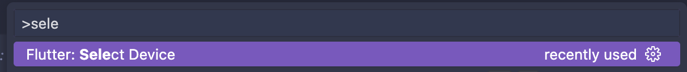
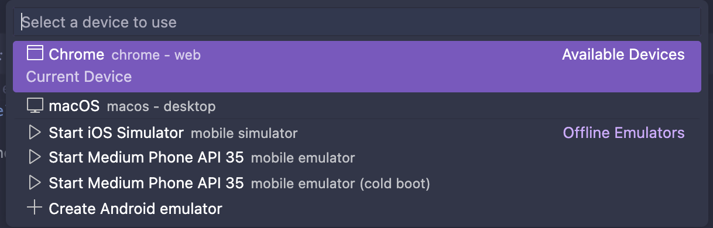
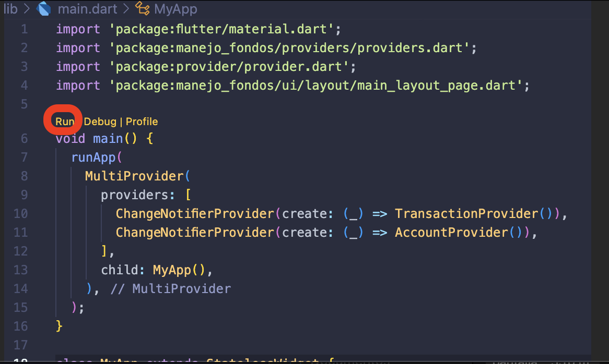
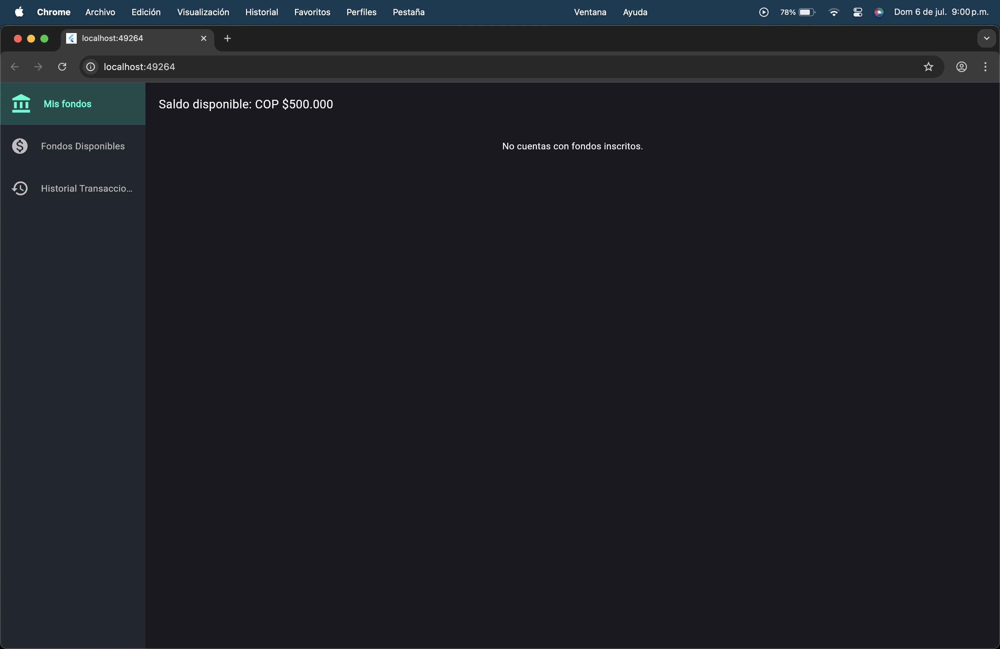

# Instrucciones para Ejecutar el Proyecto Flutter en Visual Studio Code

Sigue los pasos a continuación para configurar y ejecutar correctamente el proyecto Flutter en Visual Studio Code:

---

## ✅ 1. Verificar Instalación de Flutter

Asegúrate de tener Flutter instalado correctamente en tu máquina. Ejecuta el siguiente comando en la terminal:

```bash
flutter --version
```

## ✅ 2. Instalar Extensión de Flutter en VS Code

Instala la extensión oficial de Flutter desde el Marketplace de Visual Studio Code: 👉 [Extensión Flutter - Visual Studio Marketplace](https://marketplace.visualstudio.com/items?itemName=Dart-Code.flutter)

## ✅ 3. Seleccionar el Dispositivo: Google Chrome

Antes de ejecutar la app, asegúrate de seleccionar Google Chrome como dispositivo de destino desde la barra inferior de VS Code:

<p align="center">
  
</p>
<p align="center">
  
</p>

## ✅ 4. Ejecutar el Proyecto desde main.dart

Una vez seleccionado el dispositivo, abre el archivo main.dart y ejecuta el proyecto usando el botón de Run o presionando F5.

<p align="center">
  
</p>
<p align="center">
  
</p>
